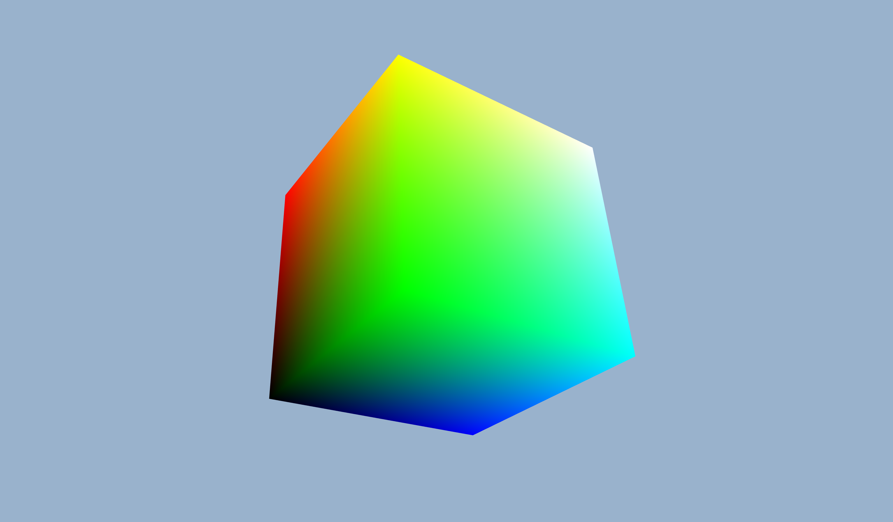
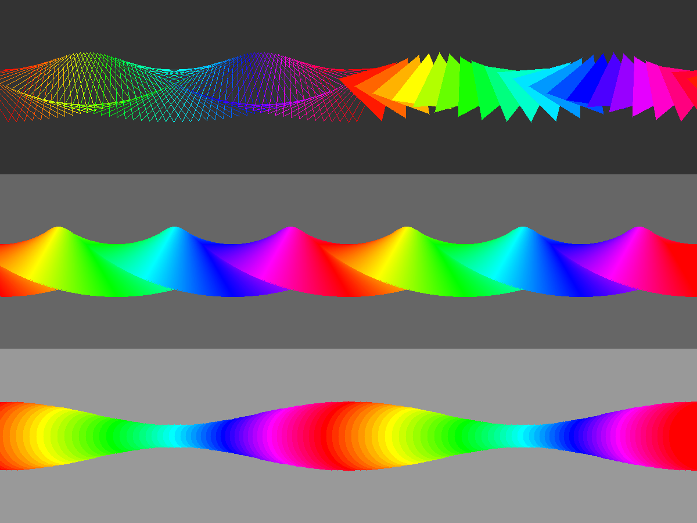
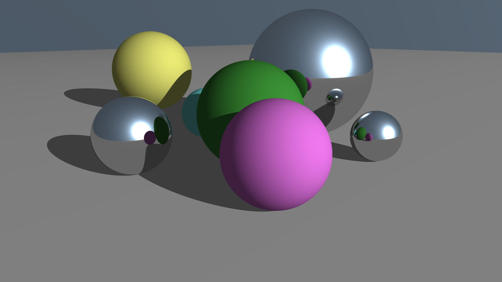

[](https://classroom.github.com/a/dB-wcMgc)
# Advanced Computer Graphics Assignment 2: Basics of 3D Rendering


## Table of Contents

- [Advanced Computer Graphics Assignment 2: Basics of 3D Rendering](#advanced-computer-graphics-assignment-2-basics-of-3d-rendering)
  * [Table of Contents](#table-of-contents)
  * [Introduction](#introduction)
  * [Prerequisites](#prerequisites)
  * [Autograding](#autograding)
    + [Code of Conduct](#code-of-conduct)
  * [Get Started](#get-started)
    + [Clone the Repository](#clone-the-repository)
    + [Build the Project](#build-the-project)
    + [Run the Project](#run-the-project)
  * [Task 1: Transformation (30 pts)](#task-1-transformation-30-pts)
    + [Subtask 1: Translation (5 pts)](#subtask-1-translation-5-pts)
    + [Subtask 2: Rotation (10 pts)](#subtask-2-rotation-10-pts)
    + [Subtask 3: LookAt (15 pts)](#subtask-3-lookat-15-pts)
    + [Subtask 4: Perspective (optinal, 0 pts)](#subtask-4-perspective-optinal-0-pts)
  * [Task 2: Rasterization (70 pts)](#task-2-rasterization-70-pts)
    + [Subtask 0: Pixel Drawing (optinal, 0 pts)](#subtask-0-pixel-drawing-optinal-0-pts)
    + [Subtask 1: Line (20 pts)](#subtask-1-line-20-pts)
    + [Subtask 2: Rectangle (5 pts)](#subtask-2-rectangle-5-pts)
    + [Subtask 3: Circle (15 pts)](#subtask-3-circle-15-pts)
    + [Subtask 4: Triangle (30 pts)](#subtask-4-triangle-30-pts)
  * [Task 3: Ray Tracing (100 pts)](#task-3-ray-tracing-100-pts)
    + [Built-in Structures](#built-in-structures)
      - [Camera Object](#camera-object)
      - [Triangle](#triangle)
      - [Sphere](#sphere)
      - [Material](#material)
      - [Point Light](#point-light)
  * [Gallery](#gallery)
  * [Postscript](#postscript)

## Introduction

Welcome to assignment 2!

This assigment contains 2 tasks, which helps you get better understanding of basic 3d rendering techniques. Specifically, we will go through the details of transformation, rasterization and ray tracing in this assignment.

Hope you enjoy it!

## Prerequisites

This assignment requires the use of Vulkan, a modern, high-performance, cross-platform graphics API. To develop with Vulkan, installation of the Vulkan SDK is necessary. Please refer to the [installation guide](https://cpp.studio/toolchain/vulkan/) for instructions. While Vulkan is a cross-platform API, ensuring its compatibility with a variety of systems, it does **NOT** work on WSL (Windows Subsystem for Linux). Consequently, this assignment should be completed on your host Windows system. If you strongly favor Linux systems, you could consider installing a distribution on your physical machine. In this case, however, be aware of potential graphics driver incompatibilities. While modern NVIDIA GPUs tend to be well-supported on Linux, AMD GPUs, especially the latest models, may not perform as optimally.

## Autograding

This assignment is auto graded!

Once you commit your code to GitHub, the autograding workflow will be triggered automatically.
You can check the status of the workflow in the "Actions" tab of your repository.
If you see a green checkmark, it means your code passed all the tests.
If you see a red cross, it means your code failed some tests.
You can click on the workflow to see the details of the test results.
If you see a yellow dot, it means the autograding workflow is still running.

You can submit your code multiple times.

### Code of Conduct

Since this assignment is auto graded, you should not modify the files related to the autograding workflow.
 Otherwise, your behavior will be considered as **CHEATING**. Actually, you should not modify any files except the ones in the list below.

- Files You Should Modify
    - `1-transformation/lib/transformation.cpp`
    - `2-rasterization/lib/draw.cpp`
    - `3-raytracing/lib/shaders/raytracing_shader.frag`
- Files You Must Not Modify
    - Anything under `.github`
    - Anything in `*/test` folders
    - Any `CMakeLists.txt` files
    - Any other file related to the autograding workflow

Submitting a commit means you agree to the code of conduct.

## Get Started

### Clone the Repository

First, you need to clone the repository to your local machine.
This assignment involves submodules, so you need to clone recursively.

```bash
git clone <your-repo-url> --recursive
```

### Build the Project

Then, you need to build the project.

```bash
cd hw2023-2-<your-github-id>
cmake -S . -B build
cmake --build build # This is the right way to build with cmake, not `make`
```

### Run the Project

This assignment contains 3 tasks, and each task has two corresponding executables.
The first executable is a test program, which is used to test your implementation.

```bash
cd build/1-transformation
./transformation_test
```

```bash
cd build/2-rasterization
./rasterization_test
```

```bash
cd build/3-raytracing
./raytracing_test
```

The second executable is a demo program, which is used to show the result of your implementation.

```bash
cd build/1-transformation
./transformation_gui
```

```bash
cd build/2-rasterization
./rasterization_gui
```

```bash
cd build/3-raytracing
./raytracing_gui
```

If you're working on Windows, and your toolchain is Visual Studio, you may find the executables in an extra `Debug` or `Release` folder.

It's recommended to use IDEs like Visual Studio or CLion to work on this assignment. Visual Studio Code is also a good choice. If you're using Visual Studio Code, you can use the [CMake Tools](https://marketplace.visualstudio.com/items?itemName=ms-vscode.cmake-tools) extension to build and run the project.

## Task 1: Transformation (30 pts)

In this task, you'll need to implement the functions in [1-transformation/lib/transformation.cpp](1-transformation/lib/transformation.cpp).
You can test your implementation by running `transformation_test`.
Before we get started, I'd like to remind you that we are using Homogeneous Coordinates. This means that a 3D point is represented as a 4D vector with the last component being 1, and a 3D vector is represented as a 4D vector with the last component being 0.

It's also worth noting that we are using column-major matrices.
Code example:

```cpp
glm::mat4 mat{
    1, 2, 3, 4,
    5, 6, 7, 8,
    9, 10, 11, 12,
    13, 14, 15, 16
}; // This matrix represents the following matrix:
   // | 1  5  9  13 |
   // | 2  6  10 14 |
   // | 3  7  11 15 |
   // | 4  8  12 16 |
```

### Subtask 1: Translation (5 pts)

This subtask requires you to implement the `Translate` function, which returns a translation matrix that translates a point by a given vector $v$.

### Subtask 2: Rotation (10 pts)

This subtask requires you to implement the `Rotate` function, which returns a rotation matrix that rotates a point by a given angle $\theta$ around a given axis $v$.

### Subtask 3: LookAt (15 pts)

This subtask requires you to implement the `LookAt` function, which returns a view matrix that transforms a point from world space to camera space. The camera is located at the origin, and it looks at the negative z-axis. The camera's up direction is the positive y-axis. The camera's right direction is the positive x-axis (This forms a right-handed coordinate system). The function takes three parameters: the camera's position, the camera's target, and the camera's up direction. You can assume that the camera's position and the camera's target are not the same point, and the camera's up direction is not parallel to the vector from the camera's position to the camera's target.

### Subtask 4: Perspective (optinal, 0 pts)

This subtask is optional. You can implement the `Perspective` function, which returns a perspective projection matrix. The function takes four parameters: the field of view (in radians), the aspect ratio (frame width divided by frame height), the near plane, and the far plane. You can assume that the field of view is in the range of $(0, \pi)$, the aspect ratio is positive, and the near plane is positive and less than the far plane. The function should return a matrix that transforms a point from camera space to clip space.  <!-- Range of z-axis in clip space --> The range of the z-axis in clip space is $[0, 1]$.

Reminder: We're using right-handed coordinate system.

## Task 2: Rasterization (70 pts)

In this task, you'll need to implement the functions in [2-rasterization/lib/draw.cpp](2-rasterization/lib/draw.cpp).
You can test your implementation by running `rasterization_test`.

In this task, you don't need to deal with the alpha channel. You can assume that the alpha channel of all the pixels is 1.0. (Which means you can simply overwrite the color of a pixel.)

### Subtask 0: Pixel Drawing (optinal, 0 pts)

We've provided a function declaration without implementation called `DrawPixel` in [2-rasterization/lib/draw.cpp](2-rasterization/lib/draw.cpp). You can implement it if you want to. This function is used to draw a pixel on the screen. We suggest you to handle the case where the pixel is out of the screen. You can use it to simplify your implementation of other functions.

You can use the following functions to get image's size:

```c++
img.GetWidth();
img.GetHeight();
```

You can also access pixel (x, y) like this:

```c++
img(x, y) = Pixel(1.0f, 0.0f, 0.0f, 1.0f);
img(x, y) = color;
```

### Subtask 1: Line (20 pts)

This subtask requires you to implement the `DrawLine` function, which draws a line from point $p_0$ to point $p_1$ on the screen. You can use the `DrawPixel` function to draw a pixel on the screen.
We suggest you to use Bresenham algorithm. You can find the pseudocode on [Wikipedia](https://en.wikipedia.org/wiki/Bresenham%27s_line_algorithm).

### Subtask 2: Rectangle (5 pts)

This subtask requires you to implement the `FillRectangle` function, which fills a rectangle on the screen. Specifically, you need to fill all the pixels whose x-coordinates are in the range of $[x_0, x_1]$ and y-coordinates are in the range of $[y_0, y_1]$.


### Subtask 3: Circle (15 pts)

This subtask requires you to implement the `FillCircle` function, which fills a circle on the screen. Specifically, you need to fill all the pixels whose distance to the center of the circle is less than or equal to the radius of the circle. In formula, you need to fill all the pixels whose coordinates $(x_p, y_p)$ satisfy the following condition:

$$\left|(x, y) - (x_p, y_p)\right|_2 \le r$$

This is well-defined because we're using discrete coordinates.

### Subtask 4: Triangle (30 pts)

This subtask requires you to implement the `FillTriangle` function, which fills a triangle on the screen. Specifically, you need to fill all the pixels whose coordinates $(x_p, y_p)$ is inside or on the boundary of the triangle $(x_1, y_1)$, $(x_2, y_2)$, $(x_3, y_3)$.

## Task 3: Ray Tracing (100 pts)

In this task, you'll need to complete the function `SampleRay` in [3-raytracing/lib/shaders/raytracing_shader.frag](3-raytracing/lib/shaders/raytracing_shader.frag). You can test your implementation by running `raytracing_test`.

The requirement is: given a ray, calculate the shaded color of that ray. The ray is defined by parameters `origin` and `direction`.
You should let the ray traverse through the scene and stop at the first intersection. The intersection is related to the scene's geometry, and having a corresponding surface.
If the surface is diffuse, you should calculate the sum of all contributions of visible lights and return immediately (No indirect lighting should be considered).
If the surface is specular, you should calculate the reflected ray's origin and direction, then repeat the process.

If the ray escaped from the scene, you should still consider the contribution of ambient light instead of returning the pure black value.

You may notice that the code is not written in C++. It's written in GLSL, which is a shading language used in OpenGL and Vulkan. GLSL is very similar to C, but it has some differences. For example, GLSL doesn't have function overloading. You can find a tutorial of GLSL [here](https://learnopengl.com/Getting-started/Shaders).

Actually, we have provided a scheme of ray tracing algorithm in the code. You need to finish the function by adding intersection tests and shading. You can introduce supplementary functions if you want to.

Be careful that GLSL does not support recursion. A typical ray tracing algorithm is tail-recursive, so you can easily replace it with a loop nevertheless.

This task has no subtasks. You need to implement the whole function for full credit.


### Built-in Structures

The scene to be rendered is defined by some built-in structures.
They are: Camera Object, Triangles, Spheres, Materials and Point Lights.

These components are given as global variables:

```glsl
layout(binding = 0) readonly uniform camera_object_struct {
    CameraObject camera_object;
};
layout(binding = 1) readonly buffer triangle_struct {
    Triangle triangles[];
};
layout(binding = 2) readonly buffer triangle_material_struct {
    Material triangle_materials[];
};
layout(binding = 3) readonly buffer sphere_struct {
    Sphere spheres[];
};
layout(binding = 4) readonly buffer sphere_material_struct {
    Material sphere_materials[];
};
layout(binding = 5) readonly buffer point_light_struct {
    PointLight point_lights[];
};
```

You can access those elements with the following code format (Just like C):

`camera_object`, `spheres[0]`, etc.

```glsl
for (int i = 0; i < camera_object.num_triangle; i++) {
    Triangle triangle = triangles[i];
    // do something with triangle
}
```

Those term which suffix in `_struct` is useless, you can simply ignore them.

#### Camera Object

```glsl
struct CameraObject {
    mat4 projection;
    mat4 camera_to_world;
    vec2 window_extent;
    uint num_triangle;
    uint num_sphere;
    vec3 ambient_light;
    uint num_point_light;
};
```

The camera object contains basic informations of the scene.

Since the framework is dealing with the first 3 variables, you can ignore them in your practice.

`num_triangle` denote the number of triangles, indexing from `0` to `num_triangle - 1`.

`num_sphere` denote the number of spheres, indexing from `0` to `num_sphere - 1`.

`ambient_light` denote the strength of ambient light.

`num_point_light` denote the number of point lights in scene, indexing from `0` to `num_point_light - 1`.

#### Triangle

```glsl
struct Triangle {
    vec3 v0;
    float padding0;
    vec3 v1;
    float padding1;
    vec3 v2;
    float padding2;
};
```

`v0`, `v1` and `v2` denote the position of 3 vertices of the triangle.

`paddingX` variables are used for memory alignment, which is important in shader coding, you can ignore them in your practice.

#### Sphere

```glsl
struct Sphere {
  vec3 origin;
  float radius;
};
```

`origin` denote the position of the sphere's origin.

`radius` denote the radius of the sphere.

#### Material

```glsl
struct Material {
    vec3 albedo_color;
    uint material_type;
};

#define MaterialDiffuse 0
#define MaterialSpecular 1
```

`albedo_color` denote the reflection ratio of each color channel when light reflects from a surface with the material,
no matter whether is a specular surface reflection or a diffuse surface reflection.
It should influence both point lights and ambient light.

`material_type` denote the material type, `0` indicates diffuse surface, `1` indicates specular surface.
The diffuse surface should be shaded with Lambertian reflection model, and the specular surface should be treated as a mirror, instead of Phong reflection model.

Since the specular surface is a mirror, the reflected ray have already represented indirect lighting, so ambient light should not be considered when shading specular surface.

#### Point Light

```glsl
struct PointLight {
    vec3 position;
    float padding0;
    vec3 power;
    float padding1;
};
```

`position` denote the position of the point light.

`power` denote the power of three channels of the point light.
If a point on a diffuse surface at position $p$ can reach the point light (not in shadow, not back facing),
contribution of each point light should be

$$
\frac{P}{\left|p - p_L\right|^2}\max\left(0, n \cdot \frac{p_L - p}{\left|p_L - p\right|}\right)
$$

where

1. $p$ denote the position of intersection
2. $p_L$ denote the point light's position
3. $n$ denote surface normal
4. $P$ denote the power of light

We ignored the $4\pi$ term in the equation for simplicity, it's not necessary to consider it in this assignment.

You may notice that there comes these `paddingX` variables again. You still can ignore them in your practice.

## Gallery

After you finish the assignment, you may run the demo program to see visual results. These demos could also be helpful for debugging. Here are reference images of the demos.

| Demo | Image |
|------|-------|
| Transformation |  |
| Rasterization |  |
| Raytracing |  |


If your local results are different from the reference images, you'd better check your code again.

## Postscript

This assignment is a combination of two from last year, you may find some tasks is beyond current lecture. But don't worry, you have more than a month to finish it. We hope you can enjoy it and learn something from it. If you have any questions, please feel free to contact us.
